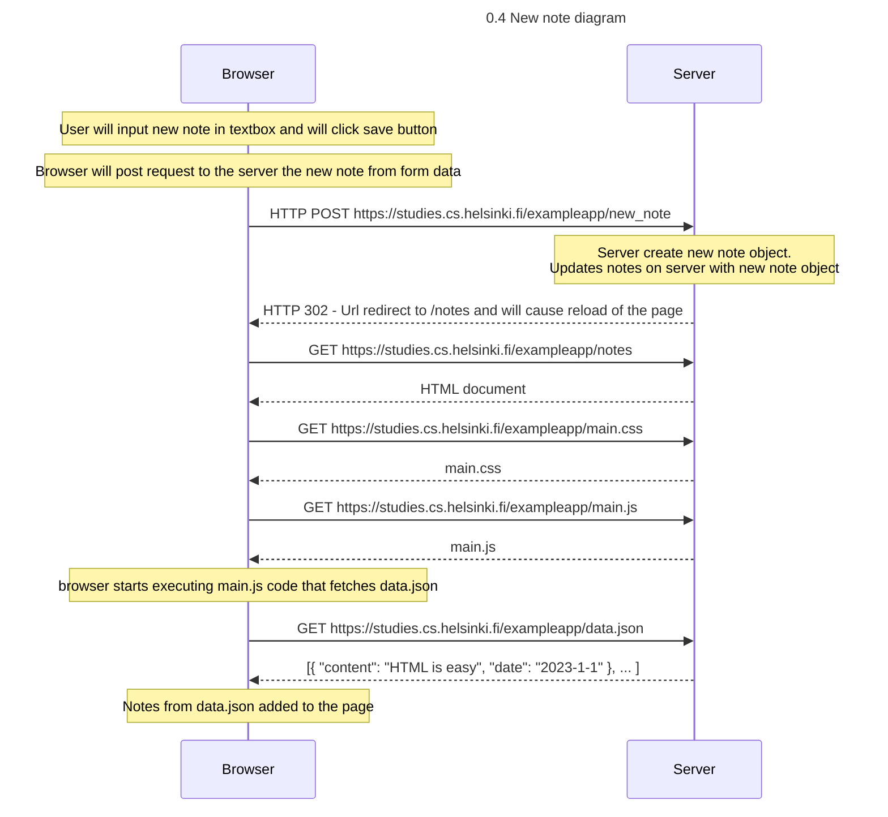

```mermaid

sequenceDiagram

    title 0.4 New note diagram
    participant Browser
    participant Server

    Note over Browser : User will input new note in textbox and will click save button
    Note over Browser : Browser will post request to the server the new note from form data


    Browser ->> Server : HTTP POST https://studies.cs.helsinki.fi/exampleapp/new_note

    Note over Server : Server create new note object. <br /> Updates notes on server with new note object

    Server -->> Browser : HTTP 302 - Url redirect to /notes and will cause reload of the page

   Browser ->> Server : GET https://studies.cs.helsinki.fi/exampleapp/notes


   Server -->> Browser : HTML document

    Browser ->> Server : GET https://studies.cs.helsinki.fi/exampleapp/main.css

    Server -->> Browser : main.css

    Browser ->> Server : GET https://studies.cs.helsinki.fi/exampleapp/main.js

     Server -->> Browser : main.js
     Note over Browser : browser starts executing main.js code that fetches data.json

      Browser ->> Server : GET https://studies.cs.helsinki.fi/exampleapp/data.json

      Server -->> Browser: [{ "content": "HTML is easy", "date": "2023-1-1" }, ... ]

      Note over Browser : Notes from data.json added to the page
```
