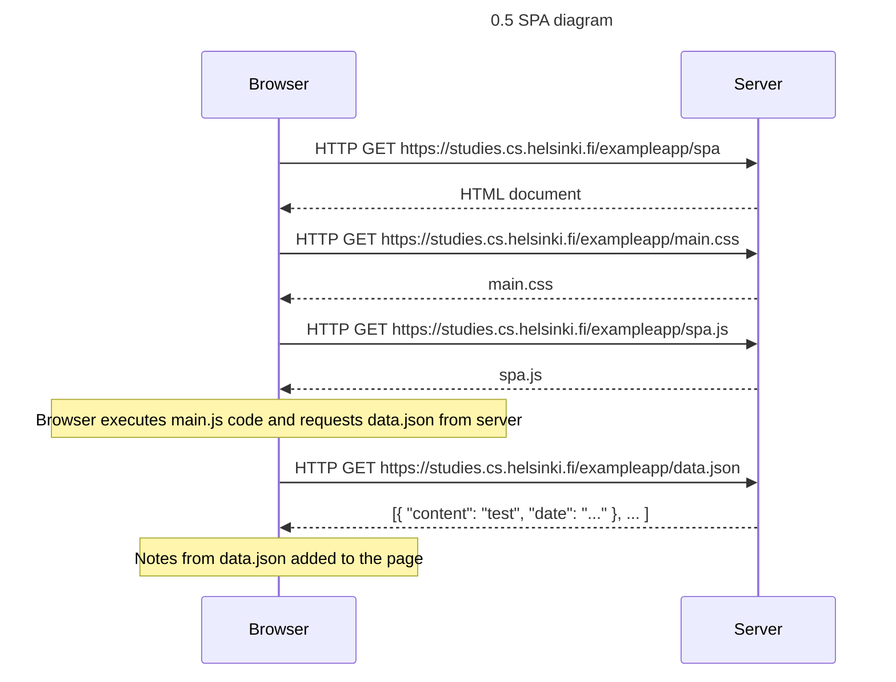

```mermaid
sequenceDiagram


   title  0.5 SPA diagram
    participant Browser
    participant Server

    Browser ->> Server : HTTP GET https://studies.cs.helsinki.fi/exampleapp/spa


   Server -->> Browser : HTML document


   Browser ->> Server : HTTP GET https://studies.cs.helsinki.fi/exampleapp/main.css


   Server -->> Browser : main.css


   Browser ->> Server : HTTP GET https://studies.cs.helsinki.fi/exampleapp/spa.js


   Server -->> Browser : spa.js


   Note over Browser : Browser executes main.js code and requests data.json from server

   Browser ->> Server : HTTP GET https://studies.cs.helsinki.fi/exampleapp/data.json

   Server -->> Browser: [{ "content": "test", "date": "..." }, ... ]


   Note over Browser : Notes from data.json added to the page
```
