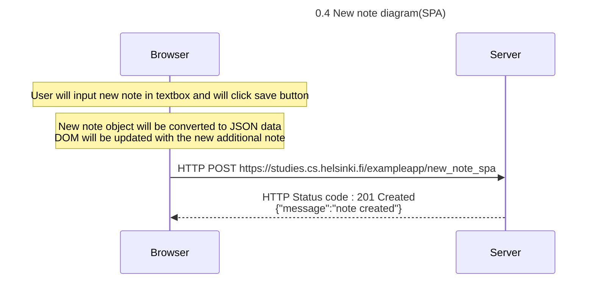

```mermaid

sequenceDiagram

    title  0.4 New note diagram(SPA)
    participant Browser
    participant Server

    Note over Browser : User will input new note in textbox and will click save button
    Note over Browser : New note object will be converted to JSON data <br /> DOM will be updated with the new additional note


    Browser ->> Server : HTTP POST https://studies.cs.helsinki.fi/exampleapp/new_note_spa

    Server -->> Browser : HTTP Status code : 201 Created <br /> {"message":"note created"}


```
